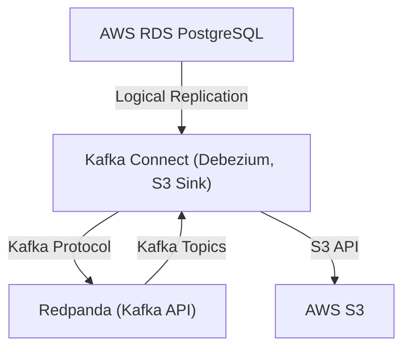

# Change Data Capture (CDC) Project

A complete end-to-end Change Data Capture (CDC) project for local development and testing, connecting to existing AWS resources.

## Quick Start

1. **Prerequisites**: Ensure Docker Desktop with Kubernetes is running
2. **Environment Setup**: Create `.env` file with your AWS credentials and configuration
3. **Deploy**: Run `./run.sh` to automate the entire setup
4. **Verify**: Check CDC data flow from RDS → Redpanda → S3

## Project Overview

This project implements a complete CDC pipeline using:
- **Data Source**: AWS RDS PostgreSQL with logical replication enabled
- **CDC Platform**: Debezium PostgreSQL Connector on Kafka Connect
- **Streaming Platform**: Redpanda cluster on local Kubernetes
- **Destination**: AWS S3 bucket for data storage

## Architecture

```
AWS RDS PostgreSQL → Debezium Connector → Redpanda → S3 Sink Connector → AWS S3
```

### Detailed CDC Pipeline Architecture



**Explanation:**
- **Debezium** runs as a connector inside **Kafka Connect** (not as a standalone service).
- **Kafka Connect** is configured to connect to **Redpanda** using the Kafka protocol. Redpanda acts as a drop-in replacement for Kafka brokers.
- **Debezium** reads changes from AWS RDS PostgreSQL (using logical replication) and writes them to topics in Redpanda.
- The **S3 Sink Connector** (also running in Kafka Connect) reads from Redpanda topics and writes data to AWS S3.
- All connector management and orchestration is handled by Kafka Connect, not by Redpanda directly.

This architecture ensures modularity, scalability, and compatibility with the Kafka ecosystem while leveraging Redpanda's performance and S3's durability.

## Prerequisites

### Local Environment (Mac)
- Docker Desktop with Kubernetes enabled
- Helm 3.x
- kubectl
- curl
- jq (for JSON processing)

### AWS Resources (Pre-existing)
- **RDS PostgreSQL Instance** with:
  - Logical replication enabled (`wal_level = logical`)
  - Replication slot created
  - Network access from your local environment
- **S3 Bucket** for CDC data storage
- **AWS Credentials** with appropriate permissions

### Network Requirements
- Connectivity from local environment to AWS RDS
- Proper security groups configured for RDS access

## Setup and Run Instructions

### 1. Environment Configuration

Create a `.env` file in the project root:

```bash
# AWS RDS Configuration
AWS_RDS_ENDPOINT=your-rds-endpoint.region.rds.amazonaws.com
AWS_RDS_DBNAME=your_database_name
AWS_RDS_USER=your_username
AWS_RDS_PASSWORD=your_password
AWS_RDS_PORT=5432

# AWS Credentials
AWS_REGION=us-east-1
AWS_ACCESS_KEY_ID=your_access_key
AWS_SECRET_ACCESS_KEY=your_secret_key

# S3 Configuration
S3_BUCKET_NAME=your-cdc-bucket-name

# Local Network Configuration
MAC_LOCAL_IP=192.168.1.100  # Your Mac's LAN IP address

# PostgreSQL CDC Configuration
POSTGRES_SCHEMA_TO_TRACK=public
POSTGRES_TABLE_TO_TRACK=your_table_name
REPLICATION_SLOT_NAME=debezium_slot

# Connector Versions
DEBEZIUM_CONNECTOR_VERSION=2.3.0.Final
S3_SINK_CONNECTOR_VERSION=10.7.0

# Kubernetes Configuration
NAMESPACE=cdc-project
REDPANDA_REPLICAS=3
```

### 2. Automated Deployment

Run the automated setup script:

```bash
chmod +x run.sh
./run.sh
```

The script will:
- Verify prerequisites
- Deploy Redpanda cluster
- Deploy Kafka Connect with Debezium
- Configure CDC connectors
- Set up port forwarding
- Verify the deployment

## Testing and Verification

### 1. Check Redpanda Status
```bash
kubectl get pods -n cdc-project
kubectl logs -n cdc-project deployment/redpanda-0
```

### 2. Verify Kafka Connect
```bash
curl -s http://localhost:8083/connectors | jq
```

### 3. Check Connector Status
```bash
curl -s http://localhost:8083/connectors/debezium-postgres/status | jq
curl -s http://localhost:8083/connectors/s3-sink/status | jq
```

### 4. Monitor CDC Data Flow
```bash
# Check Redpanda topics
kubectl exec -n cdc-project redpanda-0 -- rpk topic list

# Monitor S3 for new files
aws s3 ls s3://your-bucket-name/ --recursive
```

## Connector Configuration

### Debezium PostgreSQL Connector

The connector configuration references environment variables for sensitive data:

```json
{
  "name": "debezium-postgres",
  "config": {
    "connector.class": "io.debezium.connector.postgresql.PostgresConnector",
    "database.hostname": "${AWS_RDS_ENDPOINT}",
    "database.user": "${AWS_RDS_USER}",
    "database.password": "${AWS_RDS_PASSWORD}",
    "database.dbname": "${AWS_RDS_DBNAME}",
    "database.port": "${AWS_RDS_PORT}",
    "slot.name": "${REPLICATION_SLOT_NAME}",
    "schema.include.list": "${POSTGRES_SCHEMA_TO_TRACK}",
    "table.include.list": "${POSTGRES_SCHEMA_TO_TRACK}.${POSTGRES_TABLE_TO_TRACK}",
    "topic.creation.enable": "true",
    "topic.creation.default.partitions": "3",
    "topic.creation.default.replication.factor": "3"
  }
}
```

### S3 Sink Connector

The S3 connector uses AWS credentials from environment variables:

```json
{
  "name": "s3-sink",
  "config": {
    "connector.class": "io.confluent.connect.s3.S3SinkConnector",
    "topics": "${POSTGRES_SCHEMA_TO_TRACK}.${POSTGRES_TABLE_TO_TRACK}",
    "s3.region": "${AWS_REGION}",
    "s3.bucket.name": "${S3_BUCKET_NAME}",
    "format.class": "io.confluent.connect.s3.format.json.JsonFormat",
    "partitioner.class": "io.confluent.connect.storage.partitioner.TimeBasedPartitioner",
    "path.format": "year=!{timestamp:yyyy}/month=!{timestamp:MM}/day=!{timestamp:dd}/hour=!{timestamp:HH}",
    "timestamp.extractor": "Record",
    "flush.size": "1000",
    "rotate.interval.ms": "60000"
  }
}
```

## Troubleshooting

### Common Issues

1. **Kubernetes Connection Issues**
   ```bash
   kubectl cluster-info
   kubectl get nodes
   ```

2. **Redpanda Pod Issues**
   ```bash
   kubectl describe pod -n cdc-project redpanda-0
   kubectl logs -n cdc-project redpanda-0
   ```

3. **Kafka Connect Issues**
   ```bash
   kubectl logs -n cdc-project deployment/kafka-connect
   curl -s http://localhost:8083/connectors/debezium-postgres/status
   ```

4. **RDS Connection Issues**
   - Verify security groups allow access from your IP
   - Check RDS endpoint and credentials
   - Ensure logical replication is enabled

5. **S3 Access Issues**
   - Verify AWS credentials
   - Check S3 bucket permissions
   - Ensure bucket exists and is accessible

### Debugging Commands

```bash
# Check all resources
kubectl get all -n cdc-project

# Check secrets
kubectl get secrets -n cdc-project

# Check services
kubectl get svc -n cdc-project

# Port forward for debugging
kubectl port-forward -n cdc-project svc/redpanda 9092:9092
kubectl port-forward -n cdc-project svc/kafka-connect 8083:8083
```

## Important Notes

### Security Considerations
- Never commit `.env` files to version control
- Use IAM roles with minimal required permissions
- Regularly rotate AWS credentials
- Consider using AWS Secrets Manager for production

### Performance Considerations
- Monitor Redpanda resource usage
- Adjust connector configurations based on data volume
- Consider partitioning strategies for S3 storage
- Monitor RDS performance impact

### Development Best Practices
- Test with small datasets first
- Use separate schemas for testing
- Monitor CDC lag and throughput
- Implement proper error handling and monitoring

## Project Structure

```
.
├── README.md                 # This file
├── run.sh                   # Automated setup script
├── .env.example             # Environment variables template
├── k8s/                     # Kubernetes manifests
│   ├── redpanda/           # Redpanda deployment
│   │   ├── values.yaml
│   │   └── namespace.yaml
│   └── kafka-connect/      # Kafka Connect deployment
│       ├── deployment.yaml
│       ├── service.yaml
│       └── configmap.yaml
├── connectors/              # Connector configurations
│   ├── debezium-postgres.json
│   └── s3-sink.json
├── scripts/                 # Utility scripts
│   ├── setup-redpanda.sh
│   ├── setup-connect.sh
│   └── verify-deployment.sh
└── docs/                   # Additional documentation
    ├── troubleshooting.md
    └── monitoring.md
```

## Support

For issues and questions:
1. Check the troubleshooting section
2. Review connector logs
3. Verify environment configuration
4. Check network connectivity to AWS resources 