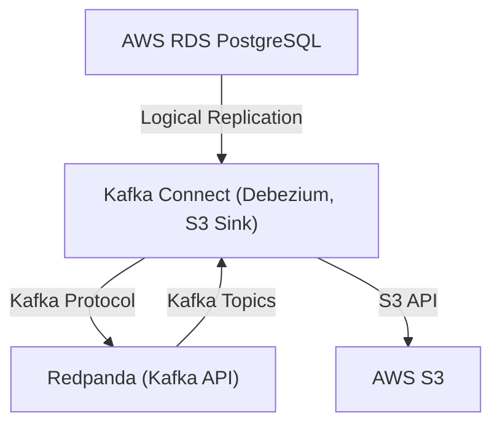

# Deploying the CDC Project on AWS EKS

## Overview

This document provides a comprehensive guide for deploying the Change Data Capture (CDC) project—originally designed for local Kubernetes (Docker/Kind)—onto Amazon Elastic Kubernetes Service (EKS). It covers architecture, AWS resource preparation, EKS cluster setup, configuration, deployment, security, networking, troubleshooting, and best practices.

---

## Table of Contents
1. [Architecture Overview](#architecture-overview)
2. [Prerequisites](#prerequisites)
3. [AWS Resource Preparation](#aws-resource-preparation)
4. [EKS Cluster Setup](#eks-cluster-setup)
5. [Configuration](#configuration)
6. [Deployment Steps](#deployment-steps)
7. [Security Considerations](#security-considerations)
8. [Networking](#networking)
9. [Troubleshooting](#troubleshooting)
10. [Best Practices](#best-practices)

---

## 1. Architecture Overview

```
AWS RDS PostgreSQL → Debezium Connector → Redpanda (Kafka API) → S3 Sink Connector → AWS S3
```

```
┌─────────────┐    ┌─────────────┐    ┌─────────────┐    ┌─────────────┐    ┌─────────────┐
│ PostgreSQL  │───▶│  Debezium   │───▶│  Redpanda   │───▶│Kafka Connect│───▶│ Amazon S3   │
│             │    │   Source    │    │   (Kafka)   │    │  S3 Sink    │    │   Bucket    │
└─────────────┘    └─────────────┘    └─────────────┘    └─────────────┘    └─────────────┘
```


- **Data Source:** AWS RDS PostgreSQL (logical replication enabled)
- **CDC Platform:** Debezium PostgreSQL Connector on Kafka Connect
- **Streaming Platform:** Redpanda cluster (Kafka API compatible)
- **Destination:** AWS S3 bucket
- **Orchestration:** Kubernetes (EKS)





---

## 2. Prerequisites

- AWS account with permissions to create EKS, VPC, IAM, RDS, and S3 resources
- AWS CLI configured (`aws configure`)
- `kubectl` installed and configured
- `eksctl` installed
- `helm` installed
- Docker (for building images, if needed)
- jq, curl, and other CLI tools as required

---

## 3. AWS Resource Preparation

### 3.1. RDS PostgreSQL
- Create an RDS PostgreSQL instance with logical replication enabled (`wal_level = logical`).
- Configure security groups to allow access from EKS worker nodes.
- Create a replication slot and user with replication privileges.

### 3.2. S3 Bucket
- Create an S3 bucket for CDC data storage.
- Apply least-privilege IAM policies for access.

### 3.3. IAM Roles and Policies
- Create IAM roles for EKS worker nodes with permissions for S3 and (optionally) Secrets Manager.
- (Recommended) Use IRSA (IAM Roles for Service Accounts) for fine-grained pod-level permissions.

---

## 4. EKS Cluster Setup

### 4.1. Create EKS Cluster
```sh
# Example using eksctl
eksctl create cluster \
  --name cdc-project \
  --region <your-region> \
  --nodegroup-name cdc-nodes \
  --node-type t3.large \
  --nodes 3 \
  --with-oidc \
  --ssh-access \
  --ssh-public-key <your-key>
```
- Ensure the cluster is created in the same VPC as RDS or with VPC peering.

### 4.2. Configure kubectl
```sh
aws eks --region <your-region> update-kubeconfig --name cdc-project
```

### 4.3. (Optional) Set Up StorageClass and Persistent Volumes
- Use EBS or EFS for persistent storage if required by Redpanda or Kafka Connect.

---

## 5. Configuration

### 5.1. Environment Variables
- Prepare a `.env` file with AWS credentials, RDS, and S3 configuration.
- For production, use Kubernetes Secrets and ConfigMaps instead of plaintext files.

### 5.2. Kubernetes Secrets and ConfigMaps
- Create secrets for AWS credentials, RDS credentials, and S3 configuration:
```sh
kubectl create secret generic aws-credentials \
  --from-literal=aws-access-key-id=... \
  --from-literal=aws-secret-access-key=... \
  --from-literal=aws-region=...

kubectl create secret generic rds-credentials \
  --from-literal=aws-rds-endpoint=... \
  --from-literal=aws-rds-dbname=... \
  --from-literal=aws-rds-user=... \
  --from-literal=aws-rds-password=... \
  --from-literal=aws-rds-port=5432

kubectl create secret generic s3-config \
  --from-literal=s3-bucket-name=...
```
- Create ConfigMaps for connector and CDC configuration.

---

## 6. Deployment Steps

### 6.1. Namespace
```sh
kubectl create namespace cdc-project
```

### 6.2. Deploy Redpanda
- Use the provided Helm chart or manifests in `k8s/redpanda/`.
- Adjust `values.yaml` for EKS (storage class, resources, node selectors, tolerations, etc.).

### 6.3. Deploy Kafka Connect
- Use the manifests in `k8s/kafka-connect/`.
- Ensure the `deployment.yaml` references the correct image and environment variables.
- Mount secrets and configmaps as environment variables.
- Adjust resource requests/limits for EKS node types.

### 6.4. Deploy Connectors
- Apply connector configurations in the `connectors/` directory.
- Use the Kafka Connect REST API or automation scripts to deploy connectors.

### 6.5. Expose Services
- Use Kubernetes `Service` objects for internal communication.
- For external access (if needed), use LoadBalancer or Ingress (with security controls).

---

## 7. Security Considerations
- Use IAM Roles for Service Accounts (IRSA) for pod-level AWS permissions.
- Store sensitive data in Kubernetes Secrets or AWS Secrets Manager.
- Restrict network access using security groups and network policies.
- Enable encryption at rest and in transit for all data stores.
- Regularly rotate credentials and audit access.

---

## 8. Networking
- Ensure EKS nodes can reach RDS and S3 endpoints (VPC/subnet configuration).
- Use private subnets for worker nodes and services.
- Configure security groups to allow only necessary traffic.
- (Optional) Set up VPC endpoints for S3 for improved security and performance.

---

## 9. Troubleshooting
- Check pod logs:
  ```sh
  kubectl logs -n cdc-project <pod-name>
  ```
- Verify service endpoints:
  ```sh
  kubectl get svc -n cdc-project
  ```
- Test connectivity to RDS and S3 from within pods.
- Use `kubectl describe` for events and error messages.
- Monitor resource usage and adjust requests/limits as needed.

---

## 10. Best Practices
- Use Infrastructure as Code (e.g., Terraform, eksctl) for repeatable cluster and resource provisioning.
- Use separate namespaces for environments (dev, staging, prod).
- Monitor cluster and application health with Prometheus, Grafana, and AWS CloudWatch.
- Implement automated backups and disaster recovery for RDS and S3.
- Regularly review IAM policies and security group rules.
- Keep all dependencies and container images up to date.

---

## References
- [Amazon EKS Documentation](https://docs.aws.amazon.com/eks/)
- [Redpanda Docs](https://docs.redpanda.com/)
- [Debezium Docs](https://debezium.io/documentation/)
- [Confluent Kafka Connect S3 Sink](https://docs.confluent.io/kafka-connect-s3-sink/current/index.html)
- [AWS RDS PostgreSQL](https://docs.aws.amazon.com/AmazonRDS/latest/UserGuide/CHAP_PostgreSQL.html)

---

*This document was generated to provide a professional, production-grade deployment guide for running the CDC project on AWS EKS, based on the existing local Kubernetes codebase.* 